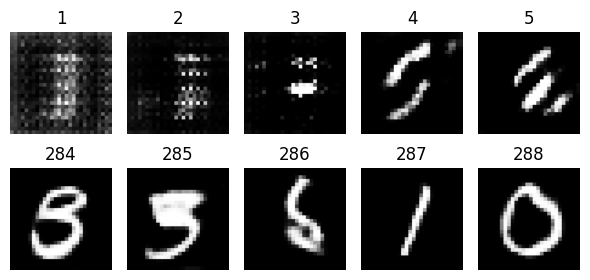
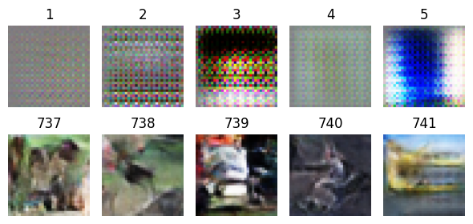
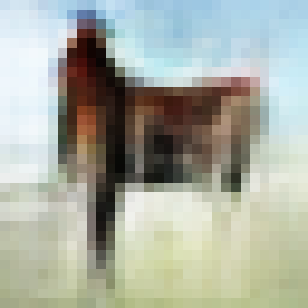

# Assignment 4 Report
 
## 1. Theory Questions:
- **Explain the minimax loss function in GANs and how it ensures competitive training
between the generator and discriminator.**\
    The minimax loss function is a function where the generator tries to minimze the discriminator's ability to distinguish between real and fake data while the discriminator tries to maximize its accuracy in identify real versus fake data. It ensures competitiveness between the generator and discriminator because the generator is trained to minimize the probability that the discriminator can identify fake data, while the discriminator tries to minimize the classification error between real and fake samples.
- **What is mode collapse, Why can mode collapse occur during GAN training? and
how can it be mitigated?**\
    Mode collapse is when the generator produces a limited variety of outputs instead of a diverse set of realistic data. This is often observed by the generator generating the same samples repeatedly. Mode collapse can be mitigated by using a Wasserstein GAN, which uses the Wasserstein distance loss metric instead of the traditional GAN loss function. Mode collapse can also be mitigated by batch normalization and minibatch discrimination. Batch normalization normalized the input to each layer which reduces the internal covariate shift. Minibatch discrimination is when the discriminator looks at multiple examples in combination rather than isolation which can detect when the generator is experiencing mode collapse.
- **Explain the role of the discriminator in adversarial training?**\
    The discriminator takes in real data from the dataset while also evaluating fake data that is from the generator. The discriminator aims to minimize the classification error between the real samples and generated samples.
- **How do metrics like IS and FID evaluate GAN performance?**\
    IS (inception score) evaluates GAN performance by using a pre-trained inception model to classify generated images. It measures image quality and diversity: the classifier should confidently predict a specific class if the image is realistic, while a diverse set of images should have a balanced class distribution.
    FID (Fréchet inception distance) uses an inception model to extract features from images which then compares the feature distribution of real and generated images using the Fréchet distance. A lower FID indicates that the generated image distribution is closer to the real image distribution.

## 2. Coding Assignment:
#### **Modify the generator to include additional convolutional layers.**

The uncommented code is what I added.

```python
def make_generator_model():
    model = tf.keras.Sequential([
    # layers.Dense(7*7*256, use_bias=False, input_shape=(100,)),
    # layers.BatchNormalization(),
    # layers.LeakyReLU(),
    # layers.Reshape((7, 7, 256)),
    # layers.Conv2DTranspose(128, (5, 5), strides=(1, 1), padding='same', use_bias=False),
    # layers.BatchNormalization(),
    # layers.LeakyReLU(),
    layers.Conv2DTranspose(128, (5, 5), strides=(1, 1), padding='same', use_bias=False),
    layers.BatchNormalization(),
    layers.LeakyReLU(),
    # layers.Conv2DTranspose(64, (5, 5), strides=(2, 2), padding='same', use_bias=False),
    # layers.BatchNormalization(),
    # layers.LeakyReLU(),
    layers.Conv2DTranspose(64, (5, 5), strides=(1, 1), padding='same', use_bias=False),
    layers.BatchNormalization(),
    layers.LeakyReLU(),
    layers.Conv2DTranspose(64, (5, 5), strides=(1, 1), padding='same', use_bias=False),
    layers.BatchNormalization(),
    layers.LeakyReLU(),
    # layers.Conv2DTranspose(1, (5, 5), strides=(2, 2), padding='same', use_bias=False, activation='tanh')
    ])
    return model
```

#### **Implement image saving after every 10 epochs.**

When I first read the instructions, I misread it to implement it every 10 seconds, which is what I did for training the model. However, I have updated the code to save every 10 epochs here:

```python
def train(dataset, epochs, data):
    ...
    # Train
    for epoch in range(epoch_var.numpy(), epochs):
        for image_batch in dataset:
            train_step(image_batch)

        # Save every 10 epochs
        if epoch % 10 == 0:
            noise = tf.random.normal([BATCH_SIZE, 100])
            save_images(noise, epoch, data)
            print(f'Saved images.')
    ...
```

This calls the save_images function which is defined in the same cell as the MNIST model, loss functions, and training loop functions:

```python
def save_images(noise, epoch, data):
    gen_images = generator(noise, training=False)
    gen_images = (gen_images + 1) / 2 # Rescale between 0 and 1

    plt.figure(figsize=(4, 4))
    if data == 'mnist':
        plt.imshow(gen_images[0], cmap='gray') # first image, grayscale for mnist
    elif data == 'cifar10':
        plt.imshow(gen_images[0]) # retain color for cifar10
    plt.axis('off')
    plt.savefig(f'images\\{data}\\gen_image_epoch_{epoch}.png', bbox_inches='tight', pad_inches=0)
    plt.close()
```

#### **Replace the MNIST dataset with CIFAR-10 and update the network for the new dimensions.**

To do this, I took the modified MNIST model and made some modifications. The edits to the convolutional layers are arbitrary and did not need to be done. Here are the changes that needed to be done to fit the dimensions of the CIFAR-10 dataset:

- Changing `layers.Dense(7*7*256, use_bias=False, input_shape=(100,))` to `layers.Dense(8*8*256, use_bias=False, input_shape=(100,))`
    This is because the target image size for MNIST is 28x28, with the strides upsampling twice (7x7 &rarr; 14x14 &rarr; 28x28) while the CIFAR-10 dataset has an image size of 32x32, with the same upsampling means (8x8 &rarr; 16x16 &rarr; 32x32).
- Changing `layers.Conv2DTranspose(1, (5, 5), strides=(2, 2), padding='same', use_bias=False, activation='tanh')` to `layers.Conv2DTranspose(3, (5, 5), strides=(2, 2), padding='same', use_bias=False, activation='tanh')`
    The number of color channels is now 3, instead of 1.
- I also had to update the discriminator model to expect an input shape of (32x32x3 instead of 28x28x1)
    `layers.Conv2D(64, (5, 5), strides=(2, 2), padding='same', input_shape=[28, 28, 1])` &rarr; `layers.Conv2D(64, (5, 5), strides=(2, 2), padding='same', input_shape=[32, 32, 3])`

After these changes, the model is updated to work with the CIFAR-10 dataset. I wanted to train these models, however, so I proceeded a bit further with these assignments just for my own curiosity.

#### **Experimentation and optional changes.**

**MNIST:**

Because of the unsupervised nature of the generator, it is not really possible for the generator to tell us what it was trying to generate, therefore we have to infer this ourselves. I decided to plot the first 5 images generated and the last 5 images generated, this can give us a good understanding if the generator has improved or not.



Clearly the generator significantly improved its ability to generate images that resemble the original dataset. Because of my misunderstanding of the 2nd part of the coding assignment, I saved images every 10 seconds rather than 10 epochs. This was trained over 500 epochs but results in 288 images.

**CIFAR-10:**

Due to the 3 channels and more complexity of this dataset, I wanted to let it train for a longer period of time. Because of this, I set up checkpoints that would save the optimizers, the models, and the epoch number to a checkpoint file, this is fairly straightforward to do in TensorFlow. I also wanted to experiment with some other methods that can be used to speed up the training. I implemented prefetching batches into memory which ensures that the next batch is ready to be used before the GPU is done with the current batch. I also changed the mixed precision accuracy to float16, which I read significantly improves training times on more modern GPUs.

```python
train_dataset = train_dataset.cache().prefetch(tf.data.experimental.AUTOTUNE)
from tensorflow.keras import mixed_precision
mixed_precision.set_global_policy('mixed_float16')
```

I let the model run on and off for 1742 epochs. I set the max limit to 3000 epochs but I decided that 1742 is enough for the scope of this assignment, and I am not sure if there would be much more improvement after more and more epochs.



The first images were just a random mess of colors but over time, the generator started making better images, some are even quite distinct, such as this horse.



